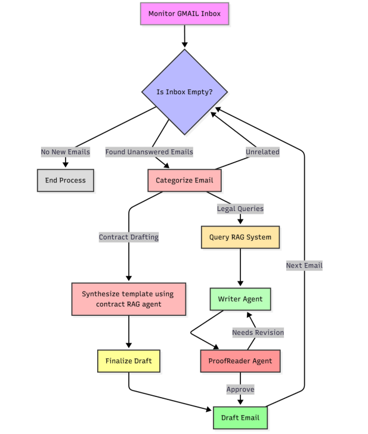

<!--
Title: Zero-Draft: Autonomous Legal Email & Contract Automation
Description: Automate legal email handling, contract drafting, and query answering using Langgraph, AI Agents, RAG, Pinecone, ChromaDB, and Gmail API.
Keywords: legal automation, AI agents, email automation, Langgraph, Langchain, contract drafting, RAG, Pinecone, ChromaDB, FastAPI, Gmail API
Author: your-name
-->

# 🚀 **Zero-Draft: Autonomous Legal Email & Contract Automation with AI Agents & RAG**

---

## **Introduction**

Legal teams today deal with **high volumes of unstructured emails**, from contract requests to policy questions.  
Manual drafting, classification, and reviewing creates:

- Slow turnaround times  
- Repetitive drafting effort  
- High operational load  
- Risk of errors or delays  

**Zero-Draft** solves this using a fully automated system built with **LangGraph**, **multimodal LLMs**, **RAG**, and **contract templates**, allowing legal teams to automate ~80% of repetitive work.

The system:

- Reads emails  
- Understands attachments  
- Retrieves legal templates or knowledge  
- Auto-drafts replies or contracts  
- Sends drafts for human review  

---

## **Features**

### 📬 **AI-Powered Email Ingestion**
- Continuous monitoring of Gmail inbox  
- Extracts:
  - Email text  
  - Attachments (PDF, DOCX)  
  - Metadata  
- Converts PDFs → images for multimodal analysis  

---

### 🧠 **Multimodal Categorization**
Emails automatically categorized as:

- **Legal Query**  
- **Contract Draft Request**  
- **Legal Document Review**  
- **Unrelated / Spam**  

Ensures the right processing path for every email.

---

### 📄 **Automated Contract Drafting (Contract RAG)**
- Auto-detects contract type (NDA, SA, Offer Letter, etc.)  
- Retrieves templates from **Pinecone**  
- Auto-fills:
  - Parties  
  - Dates  
  - Clauses  
  - Scope  
  - Jurisdiction  
- Saves clean, review-ready drafts to MongoDB  

---

### 🔍 **Legal Query Answering (Query RAG)**
- Synthesizes user questions  
- Retrieves context from **ChromaDB** internal legal playbook  
- Generates accurate, structured, non-hallucinatory legal answers  
- Saves the output as a prepared email draft  

---

### ✔ **Quality Assurance Agent**
Ensures each generated output is:

- Legally consistent  
- Grammatically correct  
- Professionally formatted  
- Ready to send  

---

### 🖥 **Human-in-the-Loop Dashboard**
- FastAPI backend  
- React + Tailwind + ReactQuill editor  
- Lawyers can:
  - Edit drafts  
  - Add comments  
  - Approve / reject  
  - Export final PDF  
  - Track status (Draft → Approved → Sent)  

---

## **System Flowchart**

  

---

## **Tech Stack**

- **LangGraph** – Agent workflow engine  
- **Gemini / Groq** – Multimodal AI models  
- **Pinecone** – Contract template vector search  
- **ChromaDB** – Legal RAG knowledge base  
- **FastAPI** – Backend API  
- **React + Tailwind + ReactQuill** – Review dashboard  
- **MongoDB** – Draft storage  
- **Gmail API** – Email ingestion  
- **pdf2image** – PDF-to-image conversion  
